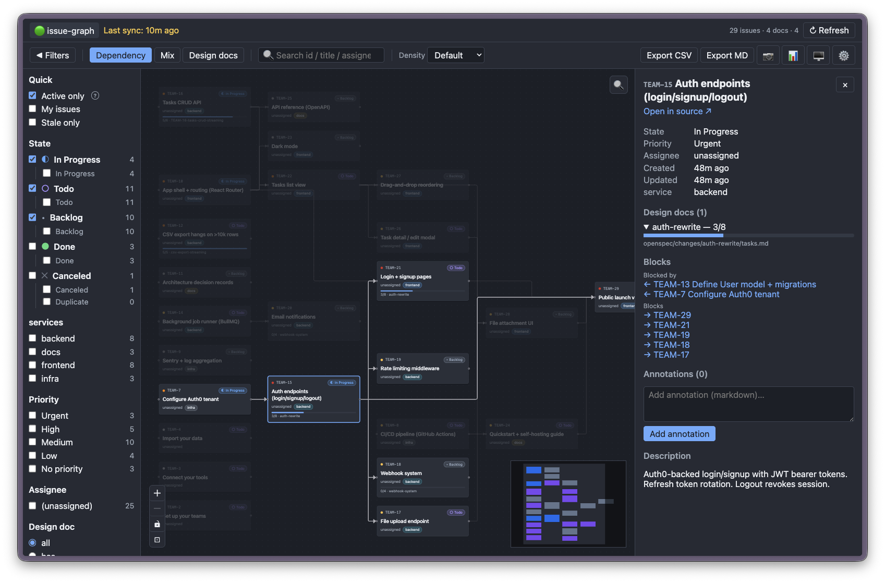

**English** | [繁體中文](README.zh-TW.md)

# issue-graph

Self-hosted, read-only graph viewer for issue dependencies. Fetches from Linear, renders an interactive graph of issues, buckets, and `blocks` relationships. Optionally enriches with local design-doc progress.



## What it shows

- **Dependency view** — `blocks` edges between issues. Default landing view. Answers "what should I work on next?"
- **Mix view** — issues grouped into buckets by a configurable Linear label group (`service`, `module`, `team`, `area` — auto-detected); cross-bucket `blocks` edges highlighted in red.
- **Project view** — issues grouped by their Linear project. Each project becomes a container; cross-project `blocks` edges highlighted.
- **Design-doc view** — issues with linked design-doc changes only.
- **Sub-issue hierarchy** — Linear's parent/sub-issue links, shown as violet edges in the dependency view (toggle with `h`, off by default) and as a `3/7 done` progress badge on every parent card. The detail panel lists the parent and each sub-issue.

## Five-minute setup

```bash
git clone https://github.com/shdennlin/issue-graph
cd issue-graph
mkdir -p data
docker compose up -d --build
open http://localhost:31415
```

The app opens on a setup form. Give your workspace a name, paste a Linear
personal API key (Linear → Settings → API → Create Personal API Key), and save.
The key is checked against Linear before it is stored, so a typo comes back
immediately instead of showing up later as an empty graph. The backend then
pulls active+recent issues, scans the optional repo at `REPO_PATH` for design
docs, and renders the dependency graph.

No `.env` is required — `docker compose` runs without one. Your API key is
stored server-side in `data/workspaces.db` and is never sent back to the
browser; the API only ever reports whether one is set.

> [!WARNING]
> **This app ships with no authentication.** Anyone who can reach the port can read every
> workspace's issue data and call the write endpoints (`POST /api/sync`, `POST/DELETE
> /api/annotations`, `PATCH /api/settings`, and the workspace routes, which accept API keys).
>
> Docker compose therefore publishes on `127.0.0.1` only. For remote access put a layer
> with auth in front rather than widening the bind — on a Tailscale host,
> `tailscale serve --bg 31415` reaches the loopback bind and terminates HTTPS, which the
> PWA needs anyway (service workers require a secure context, so a plain
> `http://<tailnet-ip>:31415` silently loses offline support). Cloudflare Access or an
> auth-ing nginx work equally well.
>
> The one exception is `POST /api/webhooks/linear`, which is designed to be published and
> is HMAC-authenticated. Expose that path alone — e.g. `tailscale funnel --bg
> --set-path=/linear-hook http://localhost:31415/api/webhooks/linear` — never the whole port.

### Configuration

There is nothing you must put in `.env`. Workspaces are managed in the app;
`.env` carries only the handful of settings the server needs *before* it can
open a database — where the data lives, which port to bind, log level — and all
of them have defaults. See [`.env.example`](.env.example).

One value is deliberately not configurable anywhere: the Linear API endpoint.
Anyone who could change it could point the app at their own host and receive
your API key in the next sync's `Authorization` header, so it is fixed in the
source.

### Realtime updates (optional)

By default the cache refreshes on a TTL, so an issue edited in Linear shows up
on the next sync. A webhook makes it appear within a couple of seconds.

1. **Set a shared secret.** Settings → Webhook, pick any long random string,
   save. This has to come after you have added a workspace — the secret is
   stored on the workspace row, not globally.
2. **Publish just the webhook path.** It is the only route designed to be
   reachable from outside; everything else must stay behind your loopback bind.
   On a Tailscale host:

   ```bash
   tailscale funnel --bg --set-path=/linear-hook \
     http://localhost:31415/api/webhooks/linear
   ```

3. **Register it in Linear.** Settings → API → Webhooks → new webhook, URL
   `https://<your-host>.ts.net/linear-hook?w=<workspace-id>`, and paste the same
   secret. The `?w=` is what routes a delivery to the right workspace, so one
   funnel mount serves all of them.

Deliveries are HMAC-verified, rejected if the timestamp is stale, rate-limited,
and a burst is collapsed into a single sync. Settings → Webhook shows accepted
and rejected counts — worth a look if updates stop arriving, since a webhook
that silently stops just looks like a stale graph.

Note that the secret lives on the workspace row, so removing and re-adding a
workspace means setting it again.

### Multiple Linear workspaces

Add as many as you like from **Settings → Workspaces**. Each one needs a short
id (a slug like `client-a`) alongside its name; that id appears in the URL as
`?w=client-a` and names the folder its cached data lives in, so re-adding an id
you used before reconnects that workspace's existing cache instead of
re-syncing from scratch.

The top-left becomes a **tab bar** once you have a workspace. Each tab
holds its own workspace + filters + view + viewport, so you can keep two
workspaces (or two views of the same workspace) open side-by-side and
flip between them without losing context. Drag tabs left/right to reorder,
`Cmd/Ctrl + 1..9` to jump to the Nth tab. Switching tabs (or workspaces)
does not require a backend restart, and neither does changing an API key.

Each workspace gets isolated local data:

```text
data/workspaces.db              <- the roster: names, API keys, webhook secrets
data/workspaces/personal/graph.db   <- cached issues; safe to delete and re-sync
data/workspaces/client-a/graph.db
```

Only the first of those is worth backing up: it is small, holds your
credentials, and cannot be rebuilt. The `graph.db` files are a cache.

Removing a workspace deletes its roster entry and leaves its data directory
alone, so nothing is destroyed behind a delete button.

`Reset current workspace data` only clears the active profile's cache. Other
workspace databases are left untouched.

For profile naming, Docker mounts, and design-doc scanning with multiple repos,
see [Advanced workspace profiles](docs/advanced-workspaces.md).

### Optional design-doc integration

If your team writes design docs / RFCs / change proposals as markdown files alongside your code, `issue-graph` can scan them and show **per-issue progress bars** plus a "design-doc only" view filter.

> [!IMPORTANT]
> Only the [Spectra](https://spectra.5xcamp.us/) / [OpenSpec](https://openspec.dev/) layout is supported, with proposals at `<REPO_PATH>/<spec_dir>/changes/<name>/proposal.md` and `tasks.md`. `<spec_dir>` is `openspec/` for OpenSpec; for Spectra it comes from `spec_dir` in `.spectra.yaml` (defaulting to `docs/specs/`, falling back to `openspec/` during migration). Other formats (ADRs, custom layouts) are not auto-detected.

See **[Design-doc integration](docs/design-doc-integration.md)** for the full setup, three linkage strategies (frontmatter / folder name / `Linear: PROJ-123` line), and the Coverage report workflow.


### Install as a desktop app (optional)

`issue-graph` ships a web app manifest and service worker, so once it's running you can install it as a standalone window:

- **Chrome / Edge:** click the **install** icon in the URL bar (or `⋮` → *Install Issue Graph*).
- **Safari (macOS):** *File* → *Add to Dock*.

The service worker pre-caches only the app shell (HTML / CSS / JS / icons). Linear data and the SSE event stream stay network-only, so workspace data is never served stale. Uninstalling reverses both — no leftover state on disk.

## Customization

`issue-graph` autodetects common Linear label group names (`service|component|owner|module|team|area|domain` for buckets, `type|kind|category` for icons). For different naming conventions or full control via `label-schema.yaml`, see **[Customizing labels and icons](docs/configuration.md)**.

## Backup posture

Almost nothing here is worth backing up. `issue-graph` is a view over Linear:
delete a cache and the next sync rebuilds it.

The one exception is **`data/workspaces.db`** — a few KB holding the workspace
roster, API keys and webhook secrets. It cannot be rebuilt, though recreating it
means little more than re-entering each workspace by hand. Everything under
`data/workspaces/<id>/` is a cache; only its snapshot history and any
annotations are unrecoverable, and neither is treated as durable data.

There is no backup script. If you want one, `rsync` the `data/` directory —
and note that doing so copies your API keys, so treat the destination
accordingly.

## Architecture

- **Single Docker image** running both backend (Hono + Bun's built-in SQLite) and frontend (React + React Flow + dagre).
- **Pluggable backend adapter** (`src/backend/sources/`) — Linear in v1; Jira / Plane / GitHub Projects in future.
- **Pluggable design-doc adapter** (`src/backend/designdoc/`) — [Spectra](https://spectra.5xcamp.us/) / [OpenSpec](https://openspec.dev/) in v1.

For full design rationale, see [`docs/PRD.md`](docs/PRD.md).

## Backends

- **v1**: [Linear](https://linear.app) (read-only via personal API key)
- **Future** (architecture is in place): Jira, Plane, GitHub Projects

## URL deep linking

The active workspace, view, every filter, the focused node, and the theme are encoded in the URL:

```
http://localhost:31415/?w=team_a&view=project&bucket=svc1,svc2&priority=1,2&focus=PROJ-123&theme=dark
```

Share a link in chat — your teammate sees the same view. Valid `view=`
values are `dependency`, `mix`, `project`, `designdoc`. The `w=`
parameter selects a workspace profile by id.

## Keyboard

Press `?` in the app for the full cheat sheet. Highlights:

- `Cmd/Ctrl + F` — find on canvas; `Enter` jumps to next match and returns keyboard focus to the canvas
- `Cmd/Ctrl + Shift + F` — focus the toolbar filter search
- `Cmd/Ctrl + 1..9` — switch to the Nth tab in the tab bar (each tab keeps its own filters / view / viewport)
- `c` / `Shift + C` — isolate chain on focused issue (preserve / auto-layout)
- `r` — toggle Related-edges overlay
- `h` — toggle sub-issue hierarchy overlay (violet edges; also pulls 1-hop parent/children into chain isolation)
- `Shift + R` — re-layout (re-run dagre, recenters on focused issue)
- `Esc` — peel one layer: Find → context menu → focused issue → chain isolation
- `Cmd/Ctrl + click` on a node — multi-select
- `Cmd/Ctrl + Shift + S` — screenshot the current canvas as PNG
- Right-click on a node — context menu
- Double-click a node — open in Linear

> [!NOTE]
> **Desktop-first.** Hover-highlight and the keyboard shortcuts above assume a real keyboard + pointer. On touch devices the basics still work (click to focus / pin, pinch to zoom, drag to pan, the toolbar / detail panel) but the fast hover-to-scan flow doesn't translate.

## Raycast extension

A [Raycast](https://raycast.com) extension lives in [`integrations/raycast/`](integrations/raycast/) — fuzzy-search every cached issue **across all workspaces** and jump straight to one, without opening the app first.

- **Search Issues** — type to filter by id, title, assignee, or workspace. Results are grouped by state (Triage → In Progress → Todo → Backlog → Completed → Canceled) and the issues you open most often float to the top (frecency).
- **Inline detail** (`⌘D`) — status, priority, assignee, due date (overdue flagged red), labels, project, milestone, relations, sub-issues, comments — read from the local cache, no extra calls.
- **Open straight into the PWA** via the `web+issuegraph://` URL scheme — the OS routes it into the installed app, which focuses the issue and opens its detail panel (the PWA equivalent of Linear's `linear://`). Browser fallbacks (`⌥↵`) work with no PWA installed.

Install (needs the Raycast app):

```bash
cd integrations/raycast
bun install
bun run dev        # = ray develop — imports the command into Raycast
```

Running `ray develop` once imports the extension; it stays available in Raycast even after you stop the dev process. Point **Issue Graph URL** at your host if it isn't `http://localhost:31415`. See [`integrations/raycast/README.md`](integrations/raycast/README.md) for the full action list, the `web+issuegraph://` scheme, and how to land links in the PWA window.

## Development

```bash
bun install
bun run dev        # concurrent backend + frontend (Vite proxies /api → :31415)
bun run typecheck
bun run lint
bun run test
bun run test:smoke  # control-plane checks; needs Bun (vitest cannot load bun:sqlite)
bun run build      # production build → dist/ + build/
```

## Troubleshooting

For common issues — stale cache after switching `LINEAR_API_KEY`, blank-slate reset, etc. — see **[Troubleshooting](docs/troubleshooting.md)**.

## Roadmap

See [ROADMAP.md](ROADMAP.md) for what's planned, what's likely, and what's explicitly out of scope. The original engineering PRD lives at [`docs/PRD.md`](docs/PRD.md) for historical context.

## License

[MIT](LICENSE)
