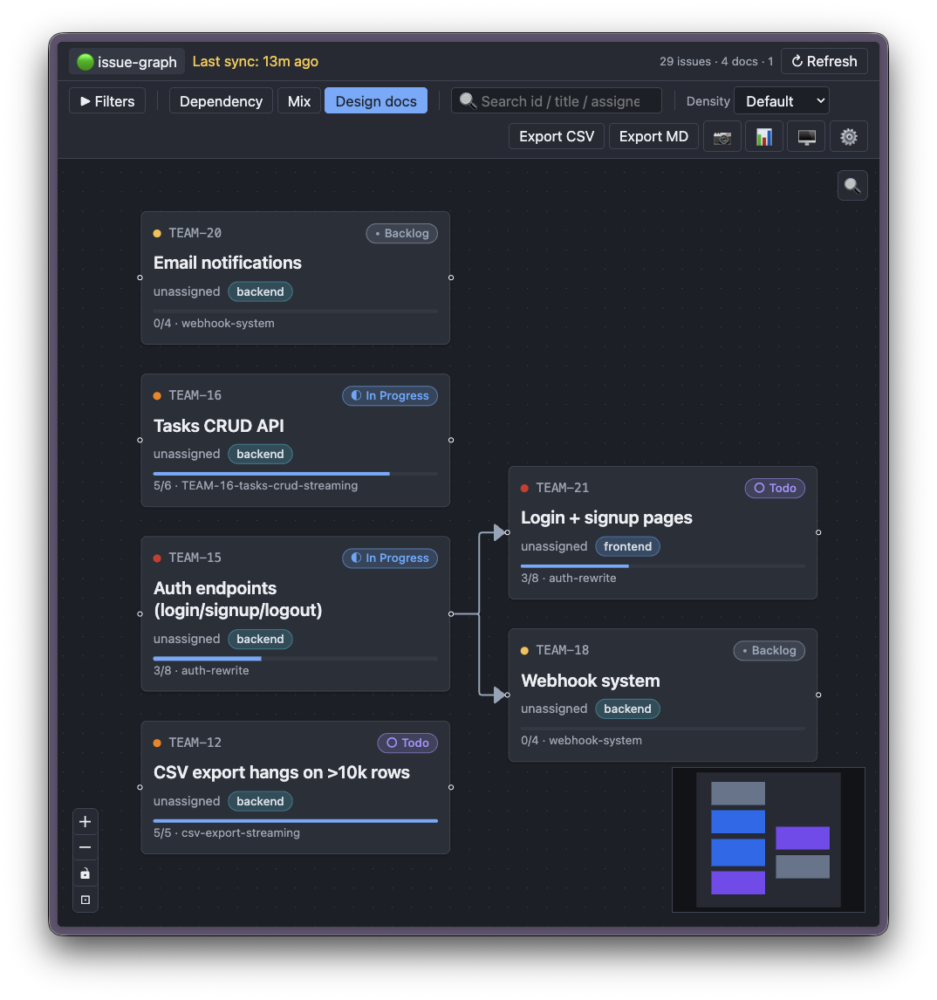

# Design-doc integration

If your team writes design docs / RFCs / change proposals as markdown files alongside your code — common in **Spec-Driven Development (SDD)** workflows — `issue-graph` can read them and show **per-issue progress bars** on the graph (e.g. `4/9 tasks done`).

> [!IMPORTANT]
> **What's supported (today):**
> - **Layout:** [Spectra](https://spectra.5xcamp.us/) / [OpenSpec](https://openspec.dev/) only. Other formats (ADRs, custom layouts, Notion exports, …) are not auto-detected.
> - **Where the adapter looks:** `<REPO_PATH>/openspec/changes/<name>/` — `REPO_PATH` is the **repo root**, *not* the spec folder. The `openspec/` subpath is hardcoded by the adapter.
> - **Required files per change:** `proposal.md` (with optional frontmatter / "Linear" line for issue IDs) and `tasks.md` containing `- [ ]` / `- [x]` checkboxes for the progress bar.

> [!NOTE]
> **What this tool means by "spec"** — a *change proposal* / *one delivery batch*: the design + tasks + scope of a single shipping unit (typically 1–3 weeks). This is the modern, AI-assisted SDD framing used by [Spectra](https://spectra.5xcamp.us/), [OpenSpec](https://openspec.dev/), and [GitHub Spec Kit](https://github.com/github/spec-kit) — distinct from longer-lived "design as decision record" specs ([ADRs](https://adr.github.io/), Python PEPs, IETF RFCs) that span many iterations. The graph's multi-spec warning ("⚠ N specs" on a card) assumes this batch-oriented framing.



## 1. Point at your repo

Set one absolute path in `.env`:

```bash
REPO_PATH=/path/to/your/repo
```

`REPO_PATH` is the **repo root**. The adapter then looks for `<REPO_PATH>/openspec/` to discover proposals — the `openspec/` part is a fixed convention, not configurable. So the effective lookup path is:

```text
<REPO_PATH>/openspec/changes/<change-name>/{proposal.md, tasks.md}
```

Used identically by `bun run dev` and `docker compose up` — under Docker the path is bind-mounted at the same location inside the container, so the backend reads it the same way in both modes. Path **must** be absolute.

If `<REPO_PATH>/openspec/` doesn't exist, the integration is silently disabled — no errors, the design-doc filter just doesn't appear in the UI.

> [!TIP]
> Curious what proposals look like? See [`demo-repo/`](../demo-repo) — a sample `openspec/` directory used by the project's own screenshots. Set `REPO_PATH=/absolute/path/to/issue-graph/demo-repo` to load it.

## 2. Link issues to design-doc changes

The adapter tries **three strategies** in sequence and unions the results. Pick whichever fits your workflow — you don't need all three:

| Strategy | When to use | Example |
|---|---|---|
| **A. Frontmatter** *(recommended for new teams)* | Want a machine-readable, copy-paste convention. Survives folder renames. | `proposal.md` opens with:<br>`---`<br>`linear: [PROJ-123, PROJ-456]`<br>`---` |
| **B. Folder name** | Want the link visible at filesystem level / `git status`. | Rename change dir to `openspec/changes/PROJ-123-checkpoint-resume/` |
| **C. Regex line** *(legacy / informal)* | Already have proposals with prose like "Related Linear issues: PROJ-105, PROJ-107". | Any line in `proposal.md` mentioning "linear" — IDs on that line are extracted. |

**Examples — all three produce the same link:**

```markdown
<!-- A. Frontmatter -->
---
linear: [PROJ-123]
---
# Refactor authentication
```

```text
<!-- B. Folder name -->
openspec/changes/PROJ-123-refactor-auth/proposal.md
```

```markdown
<!-- C. Regex line -->
Linear: PROJ-123

# Refactor authentication
```

```markdown
<!-- C. Regex line, "Related" form -->
Related Linear issues: PROJ-105 (resume), PROJ-107, PROJ-70
```

## 3. Verify with the Coverage report

Click the **📊 button** in the toolbar to open the Coverage modal. It shows:

- Total changes scanned, how many are linked, how many aren't
- Breakdown by strategy (`5 frontmatter / 2 folder / 6 regex`)
- A per-change list — click "Unlinked" filter to see exactly which proposals need a Linear ID
- Active issues (started / unstarted) without any linked design doc — i.e. work happening without a written plan

Use the report to decide where to add structure. The most common workflow:

1. Open Coverage → switch filter to **Unlinked**
2. For each unlinked change you care about, add `--- linear: [PROJ-XXX] ---` to its `proposal.md`
3. Click 🔄 Refresh in the banner
4. Re-open Coverage to confirm the count moved

The data comes from the last sync — refresh after editing files to see updates.

## 4. Other layouts

If your design docs aren't in `openspec/`, the adapter doesn't auto-detect anything. The architecture supports adding more adapters under `src/backend/designdoc/` (e.g. `rfc-folder`, `notion-export`) — see `spectra.ts` for the contract.
